# Lab 07

The lab consists of two parts. Part I will guide you through making a bi-variate thematic map using D3. Part II will help push your final project proposal toward completion.

- [Lab 07](#lab-07)
  - [Part I: Thematic mapping with D3](#part-i--thematic-mapping-with-d3)
    - [Creating TopoJSON files](#creating-topojson-files)
    - [Draw the map with new geometries](#draw-the-map-with-new-geometries)
    - [Loading multiple files with Promise.all](#loading-multiple-files-with-promiseall)
    - [Drawing multiple data layers](#drawing-multiple-data-layers)
    - [Encoding points with data-driven radius and colors](#encoding-points-with-data-driven-radius-and-colors)
    - [Adding a legend](#adding-a-legend)
    - [Filtering categorical data](#filtering-categorical-data)
    - [Assignment Requirements](#assignment-requirements)
      - [Option 1 (2 points)](#option-1-2-points)
      - [Option 2 (4 points)](#option-2-4-points)
  - [Part II. Final project proposal (3 points)](#part-ii-final-project-proposal-3-points)
    - [Anticipating your technology stack](#anticipating-your-technology-stack)


## Part I: Thematic mapping with D3

Begin by copying your solution from lesson into the **lab-02/** directory. You'll be modifying this file to create an interactive proportional symbol map of Greenhouse Gas emissions by facilities. 

**Caution:** This lab is asking you to take your existing lesson document and script and modify them with new changes. You can not merely cut and paste new code blocks below. Read your code carefully and be mindful of when you're adding to or modifying existing code. Also, if you're unsure of your lesson solution, check with your instructor before proceeding.

The final map after completion of the following instructions will look and behave like this:

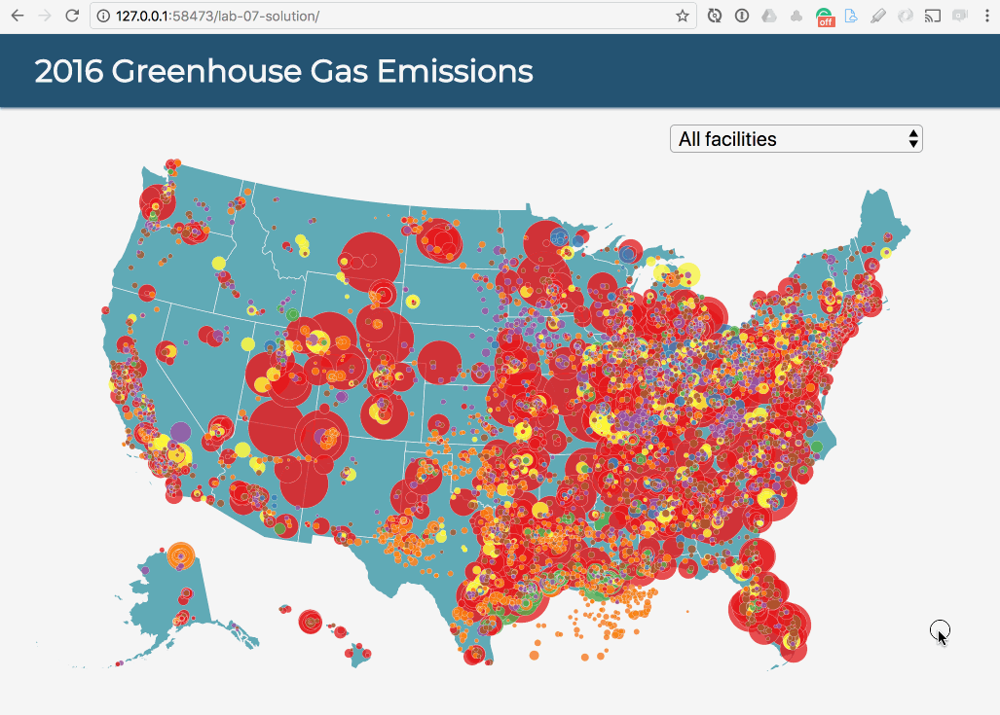  
**Figure 01.** Lab 07 final map.

### Creating TopoJSON files

To practice using D3 and TopoJSON, let's quickly recreate the basemap using US state boundaries instead of counties. Navigate your browser to download the 20m [cb_2016_us_state_20m.zip](https://www.census.gov/geo/maps-data/data/cbf/cbf_state.html) US state cartographic boundary files.

How do we create TopoJSON files? [MapShaper](http://www.mapshaper.org/) is a web-based tool that not only allows you to simplify the lifework of your geometries (significantly reducing the file size) but also allows you export/download Shapefiles and GeoJSON as TopoJSON.

Or, if you use the client/command prompt and use Node/npm, use the [TopoJSON Server](https://github.com/topojson/topojson-server). [Mapshaper's command line API](https://github.com/mbloch/mapshaper/wiki/Command-Reference) is excellent as well.

If you already have a GeoJSON file, you can also use the [GeoJSON.io interface](http://geojson.io/) to save as a TopoJSON

Using Mapshaper, I can:

* Drag the zipped Shapefiles directly into the Mapshaper web interface, 
* Simplify the linework a bit (you'll notice here it doesn't change the shape much but reduces the overall vertices by 40%), and
* Download the geometries to various formats, including GeoJSON and TopoJSON

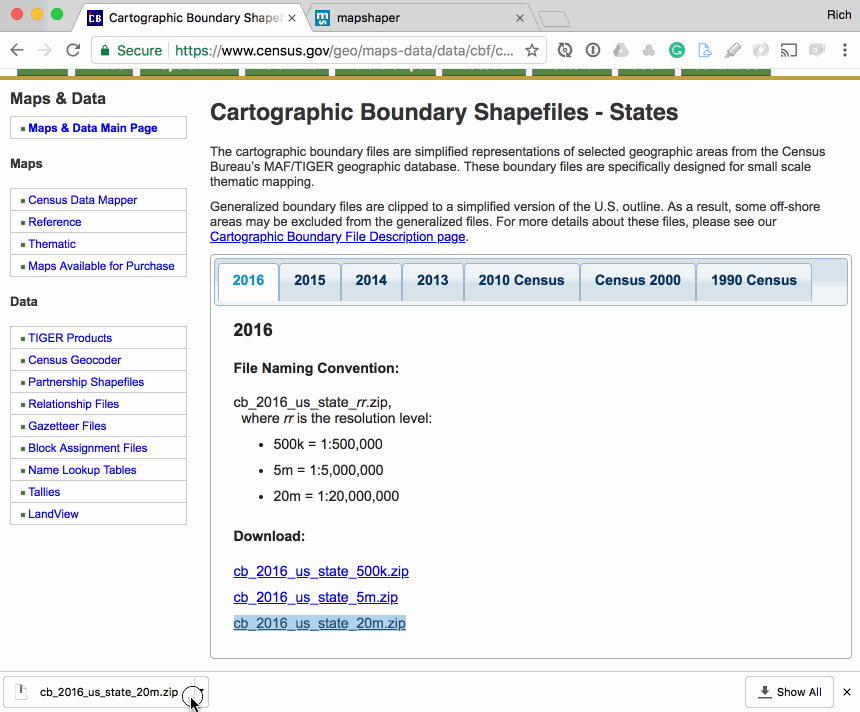

The resultant download is a TopoJSON file, saved as the source file name plus the **.json** extension (in this case, **cb_2016_us_state_20m.json**). Rename this file **us-states.json** and save it in your **lab-07/data/** directory.

**Note:** Additionally, the Mapshaper interface offers access to the client API, within which you can do things like define the coordinate precision and filter out extra property values you don't need.

### Draw the map with new geometries

Modify the JS code in your HTML document from the lesson to load the **us-states.json** into your application, rather than the US counties.

You'll need to change the path loading the data, to start:

```javascript
d3.json("data/us-states.json").then(drawMap)
```

You'll also want to edit the rest of the JS code to be semantically meaningful. In other words, you'll want to replace variable names like `countiesData` with `statesData`, etc.

In particular, you'll need to change the way the `topojson.feature()` method accesses your GeoJSON information. In the case of the US counties, we used the following code:

```javascript
var geojson = topojson.feature(countiesData, {
  type: "GeometryCollection",
  geometries: countiesData.objects.counties.geometries
})
```

The `countiesData.objects.counties` is accessing JavaScript property values within the **us-counties.json** topojson file. If you've read the TopoJSON specification (hurray for you, automatic A+!), you'll know that the encoding will store our GeoJSON information within the `objects` property.

If you open up your newly created **us-states.json** file and search the text for "object", you'll see the value `cb_2016_us_state_20m`. 

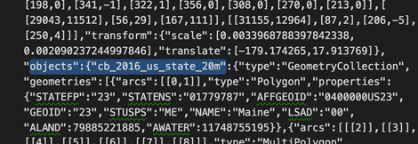  
**Figure 02.** Finding the object's key in the TopoJSON.

You'll recognize it as the name of the Shapefile and TopoJSON files. More importantly, it's the key value in this data file we need the JS to access our GeoJSON data. Modify your JS code to this:

```javascript
var geojson = topojson.feature(statesData, {
  type: "GeometryCollection",
  geometries: statesData.objects.cb_2016_us_state_20m.geometries
})
```

Likewise, you could also edit that key within the **us-states.json** TopoJSON file from `cb_2016_us_state_20m` to something else (such as `states`). In this case, you would need to reference that key within the D3 JavaScript: `geometries: statesData.objects.states.geometries`

Remember to update your CSS rules to reflect these changes (since there are no counties in this map, you shouldn't be able to find a search match for "count"):

```css
.state {
  fill: #468fa6;
  stroke: whitesmoke;
}
```

When this task is complete, you should have a basic basemap of the US states (more US-centric mapping, cough cough).

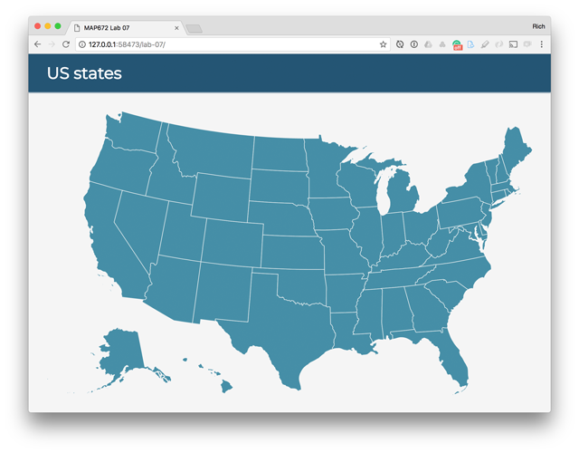  
**Figure 03.** US States basemap.

You won't need the hover/tooltip interaction to tell us the names of the states on this map. Keep the code that creates the tooltip and moves it around the page. However, delete the mouseover/out event handlers that trigger the tooltip on the states before moving on (you'll be adding this to the proportional symbols below).

### Loading multiple files with Promise.all

You'll notice within the **lab-07/data/** directory I've supplied a data file named **[facility-emissions-2016.csv](data/facility-emissions-2016.csv)** (wrangled from the accompanying **[ghgp_data_2016_8_5_17.xlsx](ghgp_data_2016_8_5_17.xlsx)** file, for your reference). These data were downloaded from the [EPA Air Emissions Inventories](https://www.epa.gov/air-emissions-inventories/emissions-inventory-system-eis-gateway).

We want to load both the **us-states.json** and **facility-emissions-2016.csv** files into our script. But we know that these are AJAX requests, so we need to handle them with an appropriate callback function that ensures they're both loaded before the script continues.

**Brief history:** Bostock wrote a great little library for handling multiple AJAX requests called [queue.js](https://github.com/d3/d3-queue). You can still use it. However, technology moves forward, and fortunately, Bostock's commitment to open web standards is strong. We no longer need to use the queue.js library and can instead use the native [Promise.all](https://developer.mozilla.org/en-US/docs/Web/JavaScript/Reference/Global_Objects/Promise/all) method.

To load both our data files into our application, first, define two variables and assign the fetch method result to the variables. You'll want to replace the single `d3.json("data/us-states.json")` statement with these statements below. Note how D3 supports a `.csv()` method (no need for a separate Omnivore or Papa Parse library!).

```javascript
// synchronous calls to data files
var statesJson = d3.json("data/us-states.json")
    facilityCSV = d3.csv("data/facility-emissions-2016.csv")
```

Then, use the Promise method to wait for them to load before calling our `drawMap()` function. Here, we'll also redefine our `drawMap()` function's parameter name to be `data` since we're not just dealing with one dataset anymore.

```javascript
// use promise to call all data files, then send data to callback
Promise.all([statesJson, facilityCSV]).then(drawMap)

function drawMap(data) {
  console.log(data)  // access to both datasets here
  // code continues ...
```

Inspect the result of the log statement within your Console. Note how the geometry data is still in TopoJSON format and the second object is an array of our CSV data (which includes latitude and longitude points).

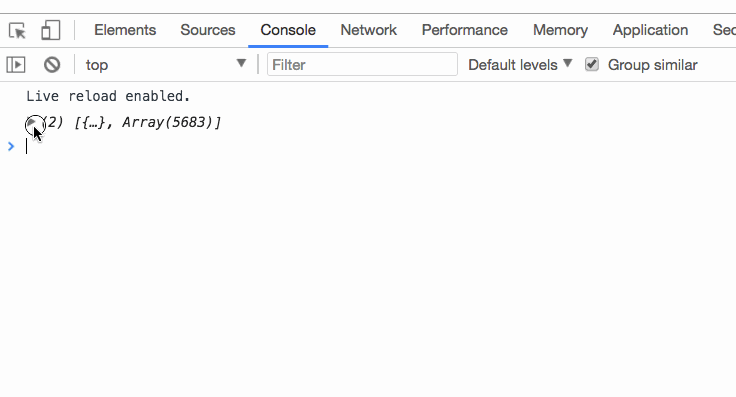  
**Figure 04** The Console output of the two data files.

We now have both our datasets loaded in the script, and because we used the Promise, we know both of the asynchronous requests are complete before moving on.

What if there is an error requesting one of the scripts (e.g., the file is corrupt, or the path to the file is wrong)? You can use a [.catch()](https://developer.mozilla.org/en-US/docs/Web/JavaScript/Reference/Global_Objects/Promise/catch) method for this. For example, we can modify our script to log an error:

```javascript
// use promise to call all data files, then send data to callback
Promise.all([statesJson, facilityCSV]).then(drawMap, error)

// function fired if there is an error
function error(error) {
  console.log(error)
}
```

You can test this error catching by changing the name of one of the files.

### Drawing multiple data layers

Next, we can assign our two datasets to separate variables for ease of use in the script, accessing them in the order in which they were passed within the Promise above (states at zero index and the facility CSV data at the first index):

```javascript
// data is array of our two datasets
var statesData = data[0],
  facilityData = data[1]
```

Your map should be working with no errors and back to the state in**Figure 03** above before proceeding.

Now draw the CSV data to the existing SVG. To do so, we'll append a new `g` element to our SVG. We'll use our `facilityData` as the data (and even apply a sort function while we do to stack the larger ones on the bottom when we draw them). Rather than appending a `path` element for each data feature, we'll append an SVG `circle` element and provide the x and y position, as well as a radius of 3. Read more about [the SVG circle element](https://developer.mozilla.org/en-US/docs/Web/SVG/Element/circle) and its properties.

```javascript
var facilities = svg.append("g")
  .selectAll("circle")
  .data(facilityData.sort(function (a, b) {
    return b.Total - a.Total // place the large ones on the bottom
  }))
  .enter().append("circle")  // enter and append a circle element
  .attr("cx", function (d) {  // define the x position
    d.position = projection([d.Longitude, d.Latitude]);
    return d.position[0];
  })
  .attr("cy", function (d) {
    return d.position[1];
  })
  .attr("r", 3)
  .attr("class", "facility")
```

The result should be our facility point locations plotted on the map. They key to plotting CSV data is 1.) that we have the latitude and longitude encoded as data attributes, and 2.) we run them through our existing `projection()` function to translate them into the screen coordinates (the same projection function used to draw our state's boundaries).

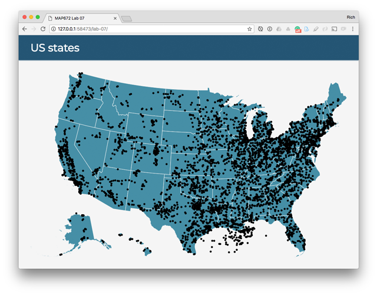  
**Figure 05.** CSV data plotted without styles.

We also gave each facility a class name of `facility`, so we can write a CSS rule to select them and style them:

```css
.facility {
  fill: #cf5635;
  stroke: white;
  stroke-width: .3;
  opacity: .8;
}
```

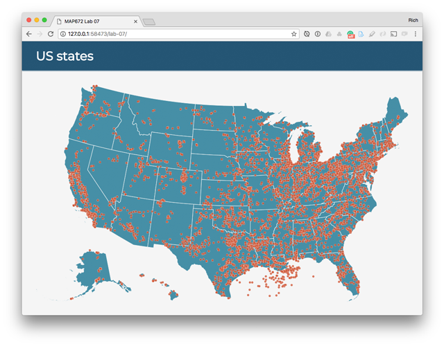  
**Figure 06.** CSV data plotted with CSS styles.

We've successfully plotted our points. Next, we want to play with some thematic symbology.

### Encoding points with data-driven radius and colors

If you scrutinize the CSV data, each facility has two types of interesting attribute information: 1.) a quantitative measure of the total reported emissions (the attribute `Total`), and the qualitative or categorical measure of the industry type (the attribute `Industry_Type`). We can visually encode both of these, the first using the visual variable of size and the second with the visual variable of hue.

Need a [refresher on Bertin's visual variables](http://www.axismaps.com/guide/general/visual-variables/)?

Toward the top of your script, first, define a new function that will accept a value within a domain of inputs and produce an output value within a specific range and assign it to a variable named `radius`.

```javascript
// define radius generator
var radius = d3.scaleSqrt().domain([0, 1e6]).range([1, 9])
```

Again, the variable `radius` now references a function that will accept an argument and return a value. Instead of giving all our circle elements a radius of 3, we can use this function and the attribute value for the emissions of each facility. Modify your script:

```javascript
.attr("r", function (d) {
  return radius(+d.Total)
})
```

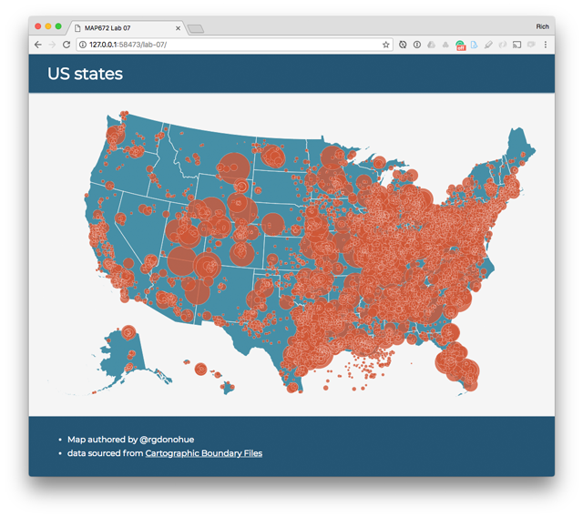  
**Figure 07.** Facilities are given a size using their radius.

Next, we can create a similar kind of function using D3's methods to encode our circles with different hues. To do so, however, we'll need to import an additional D3 module:

```html
<script src="https://d3js.org/d3-scale-chromatic.v1.min.js"></script>
```

Because these are nominal data, we don't want to use a sequential or divergent color scheme. Fortunately, D3 now supports some categorical color schemes (drawn from ColorBrewer). Again, toward the top of your script create the function and assign it to a variable for later use:

```javascript
// define color generator
var color = d3.scaleOrdinal(d3.schemeSet1)
```

You can check out all the cool options using the [d3-scale-chromatic module](https://github.com/d3/d3-scale-chromatic/blob/master/README.md#categorical) and play with other options than the `schemeSet1`.

With our color function defined, we can chain yet another method on to the statement creating our facilities, this time defining a fill color:

```javascript
var facilities = svg.append("g")
  .selectAll("circle")
  // some code omitted for this example
  .attr("r", function (d) {
    return radius(+d.Total)
  })
  .attr("class", "facility")
  .style("fill", function (d) {  // give each facility a fill style
    return color(d.Industry_Type)  // derive the hex color from the value
  })
```

This code should result in a bi-variate proportional symbol map (are you having flashbacks to Lab 09 in MAP672?).

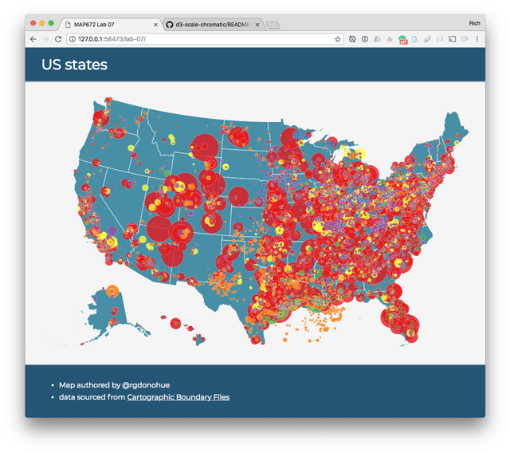  
**Figure 08.** Facilities are given a color using their type.

Now that we've created the thematic map symbology, we can add a quick legend.

### Adding a legend

Toward the bottom of your drawMap() function, call a new function named drawLegend(). Because we'll want to add the legend to our existing SVG (and use the width and height specified above), we should send this information as arguments:

```javascript
drawLegend(svg, width, height)
```

Then define the function outside of the drawMap() function body (drawn from [d3 Bubble Map](https://beta.observablehq.com/@mbostock/d3-bubble-map):

```javascript
function drawLegend(svg, width, height) {

  // append a new g element
  var legend = svg.append("g")
    .attr("dy", "1.3em")  // adjust the vertical displacement
    .attr("class", "legend")  // add a class (for CSS)
    .attr("transform", "translate(" + (width - 50) + "," + (height - 20) + ")")
    .selectAll("g")  // select all new g elements
    .data([5e6, 2e7])  // apply two numbers (approx median/max) 
    .enter().append("g");  // enter and append the two new g elements

  // place the circles vertically and apply radius
  legend.append("circle")
    .attr("cy", function (d) {
      return -radius(d);
    })
    .attr("r", radius);

  // append text to each
  legend.append("text")
    .attr("y", function (d) {
      return -2 * radius(d);
    })
    .attr("dy", "1.3em")
    .text(d3.format(".1s"));

  // append a legend label at bottom
  legend.append("text")
    .attr("y", 16)
    .text("metric tons")

}  // end drawLegend()
```

You'll also want to write a couple more CSS rules to select the legend elements and style them:

```css
.legend circle {
  fill: none;
  stroke: #ccc;
}

.legend text {
  fill: #777;
  font: 10px sans-serif;
  text-anchor: middle;
}
```

This function and style rules should append a humble legend to the lower right of your map:

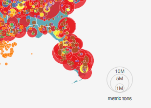  
**Figure 09.** Legend added to map.

We've now drawn an attractive static map to the page. One issue is the overcrowding of the facilities, something that interaction can be useful in solving. Let's wrap up the lab tutorial by adding a select drop-down menu allowing the user to filter by the industry type.

### Filtering categorical data

Let's create a new function to handle our user interaction objectives. First call a new function from within the bottom of the drawMap() function: 

```javascript
addFilter(facilityData, facilities)
```

Then write the function and study the comments. Here the function 1.) creates a new select element in the DOM, and 2.) generates a list of our unique values for `Industry_Type` from the CSV data.

```javascript
function addFilter(facilityData, facilities) {

  // select the map element
  var dropdown = d3.select('#map')
    .append('select')  // append a new select element
    .attr('class', 'filter')  // add a class name

  // array to hold select options
  var uniqueTypes = ["All facilities"];

  // loop through all features and push unique types to array
  facilityData.forEach(function (facility) {
    // if the type is not included in the array, push it to the array
    if (!uniqueTypes.includes(facility.Industry_Type)) uniqueTypes.push(facility.Industry_Type)
  })

  // sort types alphabeticaly in array
  uniqueTypes.sort();

  // ["All facilities", "Chemicals", "Metals", "Minerals", "Other", "Petroleum and Natural Gas Systems", "Power Plants", "Waste"]
  console.log(uniqueTypes)
}
```

Include a CSS rule selecting the newly created element with a class of `filter` and apply some rules for positioning and font-size:

```css
.filter {
  position: absolute;
  right: 48px;
  width: 260px;
  font-size: 1.3em;
}
```

We can then create new option elements for each of our unique types using D3's `.enter().append()` methods upon the data values we just created in an array.

```javascript
// select all the options (that don't exist yet)
dropdown.selectAll('option')
  .data(uniqueTypes).enter() // attach our array as data
  .append("option") // append a new option element for each data item
  .text(function (d) {
    return d // use the item as text
  })
  .attr("value", function (d) {
    return d // use the time as value attribute
  })
```

The result is a dynamically populated drop down menu. Of course, it doesn't do anything yet when we change the value:

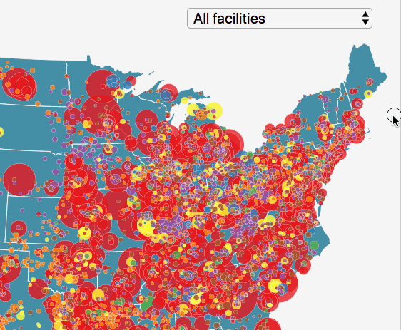  
**Figure 10.** Dropdown menu without change event.

To make the drop down update our map, we want to write a new function called `onChange()`. We can write this within the addFilter() function's body:

```javascript
function onchange() {
  // get the current value from the select element
  var val = d3.select('select').property('value')

  // style the display of the facilities
  facilities.style("display", function (d) {
    // if it's our default, show them all with inline
    if (val === "All facilities") return "inline"
    // otherwise, if each industry type doesn't match the value 
    if (d.Industry_Type != val) return "none"  // don't display it
  })
}
```

Finally, chain one more method on the existing drop-down selection, which will listen for a change and call a function named onchange() when that happens:

```javascript
var dropdown = d3.select('#map')
  .append('select')
  .attr('class', 'filter')
  .on('change', onchange)  // listen for change
```

The result should be an interactive filter (notice how fast D3's selections work).

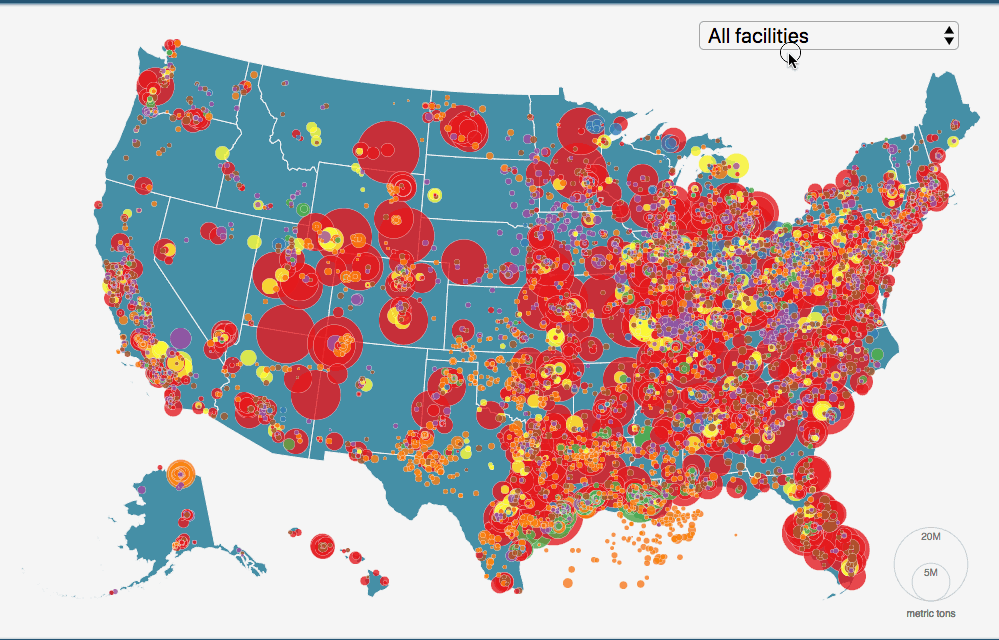  
**Figure 11.** Onchange event filtering the display of elements.

This concludes the tutorial part of Lab 07. Pick one of the following options to fulfill the assignment requirements.

### Assignment Requirements

Pick one of the following options.

#### Option 1 (2 points)

Finish the lab as outlined above using the US states and the facility emissions data. Complete these requirements, beyond what I detailed above:

- [ ] Code is cleanly written, indented, and uses semantically meaningful variable and function names
- [ ] Map includes a tooltip allowing the user to retrieve specific information about each facility, minimally including the name of the facility and a well-formatted output of the total metric tons of greenhouse gas emissions reported.
  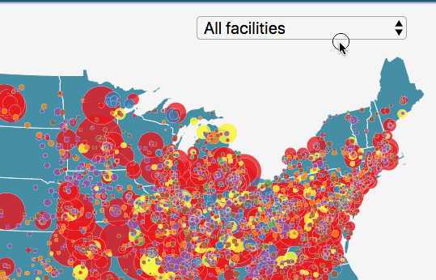  
  **Figure 12.** Tooltip example.
- [ ] update map title, author, and links to appropriate meta data

Commit your changes as you work and push the remote repository for help and final submission.

#### Option 2 (4 points)

First, fulfill the requirements for Option 1. Save these within the **lab-07/index.html** file.

Then create a new map with a new dataset of your choosing using D3. Create a new HTML document for your map (name the file what you wish, but please keep it in the **lab-07/** directory). You're limited to neither the US nor point symbol data, and you may consider [other thematic types](https://bl.ocks.org/mbostock/2522624ada2c1f9e0fafb75cca09442b).

Commit your changes as you work and push the remote repository for help and final submission.

## Part II. Final project proposal (3 points)

Submit a 1-2 page written project proposal that includes:

**from lab 06**
* description of data topic (with an anticipated map title)
* map objectives
* user needs, articulated through a persona/scenario
* data sources
* any updated specific feedback from your instructor

**new this week**
* identification of anticipated thematic representation (e.g., dot map, choropleth, prop symbols, etc.)
* a content and requirements list (see Module 05)
* description of the anticipated user interaction (UI)
* a series of low fidelity wireframes, paper prototypes, or mockups (in addition to the 1-2 pages)

Please submit this proposal in the Markdown format. However, ensure spelling and grammar are correct (you can paste Markdown into a spelling checker, or search for spelling plugins for your text editor of choice).

Also, include a brief description of your anticipated technologies you'll use to complete the project:

### Anticipating your technology stack

While your answer to this question need not be definite at this point, briefly describe the "technology stack" you plan to use for your final map. Your description of the technology stack should include:

* data and information processing tools, web-based or desktop (i.e., QGIS, [MapShaper](http://www.mapshaper.org/))
* the format you'll use to store your data (i.e., flat files such as CSV or GeoJSON, database technology such as CARTO)
* the JS libraries you anticipate using or need (include any relevant plugins)
* other relevant web technologies you'll be using (i.e., HTML, CSS)
* the hosting platform you intend to use to host your map (i.e., GitHub pages, your own web server, [http://surge.sh/](http://surge.sh/))

Note: This is a draft of the information we'll want to include in your final map proposal. While informative to curious users of your map, the proposal also looks good to employers and clients in terms of demonstrating your expertise in the world of open source web mapping!